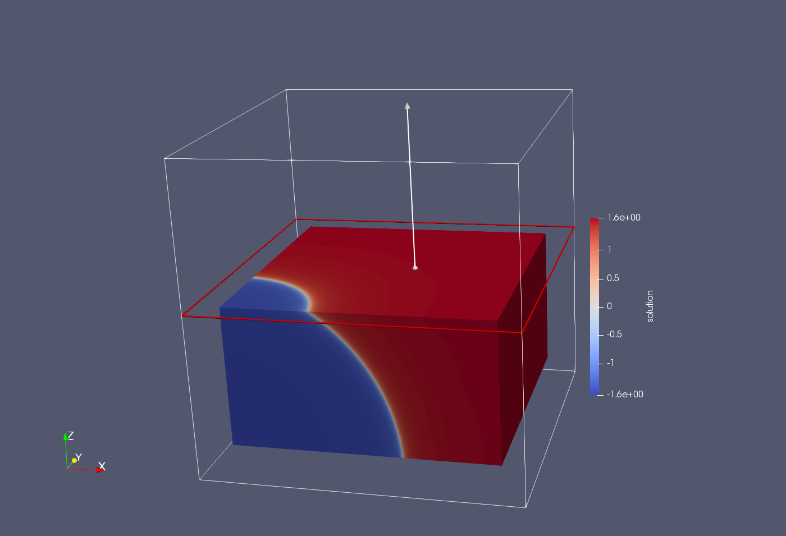

This tutorial aims to introduce the user on **`FEMPAR`** style driver programs. 
Following the steps of [The Commented Code](#the-commented-code) would help the user to understand 
the steps to solve a simple Finite Element problem, as the basis for understanding more complex **`FEMPAR`**  data structures.

### Compilation and execution
In order to compile this tutorial, first compile **`FEMPAR`**, see the [README](../../01_Readme.html#compilation).

Then, move to the  **`FEMPAR`** build directory, create the tutorials build subfolder, and compile the tutorial.
```
cd build
mkdir TUTORIALS
cd TUTORIALS
cmake ../../fempar/Tutorials -DFEMPAR_DIR=../FEMPAR -DFEMPAR_TUTORIAL=tutorial_01_poisson_sharp_circular_wave
make
```

Once the tutorial is compiled, you can run it and play around with it:
```
bin/tutorial_01_poisson_sharp_circular_wave
```


### What this program does

This tutorial tackles the Poisson problem. In strong form this problem reads: find  such that

  

where  is a given source term, and  is the unit box domain, with  being the number of space dimensions.
Poisson equation problem is supplied with inhomogeneous Dirichlet BCs  on , with  a given function defined on the domain boundary.

@note
Other BCs, e.g., Neumann or Robin (mixed) conditions can also be considered for the Poisson problem. While these sort of BCs are supported by **FEMPAR** as well, we do not consider them in this tutorial for simplicity.
@endnote

The source term  and Dirichlet function  are chosen such that the exact (manufactured) solution of poisson equation is:


This solution has a sharp circular/spherical wave front of radius  centered at .

Figure 1 and Figure 2 illustrate the solution for , resp., and parameter values
, , and ,  for , resp.





