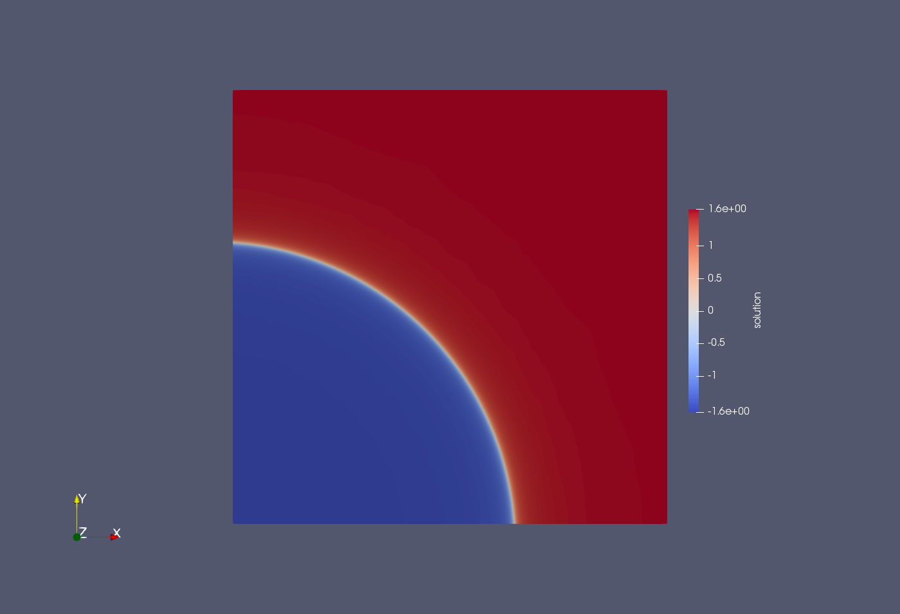
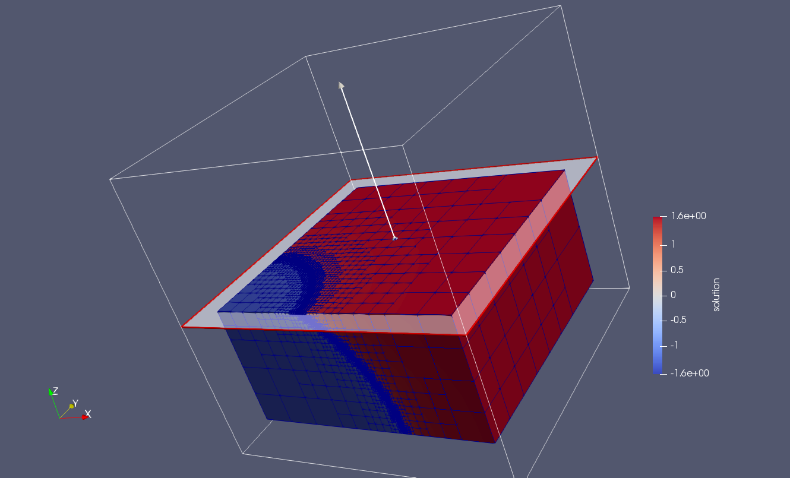
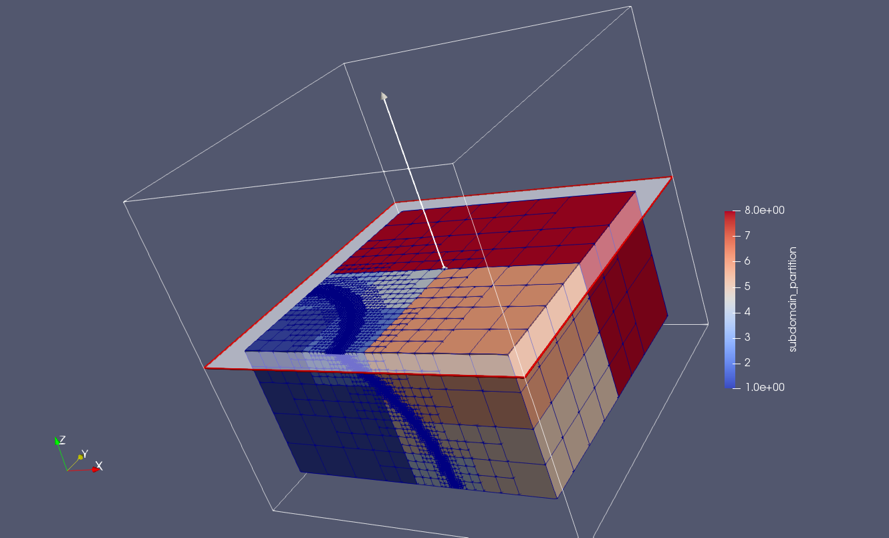

This tutorial aims to introduce the user on **`FEMPAR`** style driver programs. 
Following the steps of [The Commented Code](#the-commented-code) would help the user to understand 
the steps to solve a Finite Element problem, as the basis for understanding more complex **`FEMPAR`**  data structures.

### Compilation and execution

In order to compile this tutorial you need to have access to **`FEMPAR`** library.
The [Quick start](../../01_Readme.html#quick-start) on the main [README](../../01_Readme.html) is the easiest way to get **`FEMPAR`**.
You can see a more custom and complex installation process in the [Native compilation](../../01_Readme.html#native-compilation) section.

Then, the very first point to start with are the [tutorial programs](https://gitlab.com/fempar/fempar/tree/experimental/Tutorials) available at the official FEMPAR repository. 

After completing the previous compilation steps, you can compile and run FEMPAR tutorials with the following steps:

```bash
...
$ FEMPAR_TUTORIALS_DIR=$SOURCES_DIR/Tutorials
$ mkdir -p $FEMPAR_TUTORIALS_DIR
$ cd $FEMPAR_TUTORIALS_DIR
$ cmake -DFEMPAR_DIR=$FEMPAR_DIR -DFEMPAR_TUTORIAL=tutorial_03_poisson_sharp_circular_wave_parallel_amr $SOURCES_DIR/Tutorials
$ make -j 4
$ bin/tutorial_03_poisson_sharp_circular_wave_parallel_amr --help                              # get informative message on screen
$ bin/tutorial_03_poisson_sharp_circular_wave_parallel_amr [optional command line arguments]   # execute the tutorial
```

### What this program does

This tutorial tackles the Poisson problem. 


#### Model problem

In strong form this problem reads: 

> find  such that  where  is a given source term, and  is the unit box domain, with  being the number of space dimensions.

Poisson equation problem is supplied with inhomogeneous Dirichlet BCs  on , with  a given function defined on the domain boundary.

@note
Other BCs, e.g., Neumann or Robin (mixed) conditions can also be considered for the Poisson problem. While these sort of BCs are supported by **FEMPAR** as well, we do not consider them in this tutorial for simplicity.
@endnote

The source term  and Dirichlet function  are chosen such that the exact (manufactured) solution of poisson equation is:


This solution has a sharp circular/spherical wave front of radius  centered at .

Figures below illustrate the solution for , resp., and parameter values
, , and ,  for , resp.




#### Parallel FE discretization

This tutorial exploits a set of _fully-distributed_ data structures and associated algorithms available in **`FEMPAR`** for the scalable solution of PDE problems in high-end distributed-memory computers. Such data structures are driven by this tutorial in order to efficiently  parallelize the AMR loop of [tutorial 02](../tutorial_02_poisson_sharp_circular_wave_amr/index.html). In order to find  at each adaptation step, this tutorial combines the CG FE formulation for Poisson problem with a scalable domain decomposition preconditioner for the fast iterative solution of the linear system resulting from FE discretization.

@note
**`FEMPAR`** v1.0.0 also supports _parallel_ DG-like non-conforming FE formulations for the Poisson problem. However, a scalable domain decomposition preconditioner suitable for this family of FE formulations is not yet available in its first public release.
This justifies why this tutorial restricts itself to the CG FE formulation.
In any case, we stress that **`FEMPAR`** is designed such that this preconditioner can be easily added in future releases of the library.
@endnote

In this section, we briefly introduce some key ideas underlying the extension of the approach presented in [FE discretization](../tutorial_02_poisson_sharp_circular_wave_amr/index.html#fe-discretization) of [tutorial 02](../tutorial_02_poisson_sharp_circular_wave_amr/index.html) to distributed computing environments. 

It order to scale FE simulations to large core counts, the adaptive mesh must be partitioned (distributed) among the parallel tasks such that each of these only holds a local portion of the global mesh. (The same requirement applies to the rest of data structures in the FE simulation pipeline, i.e., FE space, linear system, solver, etc.) Besides, as the solution might exhibit highly localized features, dynamic mesh adaptation can result in an unacceptable amount of load imbalance. Thus, it urges that the adaptive mesh data structure supports _dynamic load-balancing_, i.e., that it can be re-distributed among the parallel processes in the course of the simulation.

As mentioned in [FE discretization](../tutorial_02_poisson_sharp_circular_wave_amr/index.html#fe-discretization) of [tutorial 02](../tutorial_02_poisson_sharp_circular_wave_amr/index.html), dynamic -adaptivity in **`FEMPAR`**
relies on forest-of-trees meshes. Modern forest-of-trees manipulation engines provide a scalable, linear runtime solution to the mesh (re-)partitioning problem based on the exploitation of Space-Filling Curves (SFCs). SFCs provide a natural means to assign an ordering of the forest-of-trees leaves,
which is exploited for the parallel arrangement of data. For example, in the `p4est` library, the forest-of-octrees leaves are arranged in a global one-dimensional data array in increasing Morton index ordering. This ordering corresponds geometrically with the traversal of a -shaped SFCs (a.k.a. Morton SFCs) of . This approach allows for fast dynamic repartitioning. A partition of  is simply generated by dividing the leaves in the linear ordering induced by the SFCs into as many equally-sized segments as parallel tasks involved in the computation.

The parallel -adaptive triangulation in **`FEMPAR`** reconstructs the local portion of  corresponding to each task from the distributed forest-of-octrees that `p4est` handles internally. The local portion of each task is composed by a set of cells that it owns, i.e., the _local cells_ of the task, and a set of off-processor cells (owned by remote processors) which are in touch with its local cells, i.e., the _ghost cells_ of the task. This overlapped mesh partition is used by the library to exchange data among nearest neighbours, and to glue together the global DOFs of  which are sitting on the interface among subdomains, as required in order to construct FE spaces for conforming FE formulations in a distributed setting.

The user of the library, however, should also be aware to some extent of the distributed data layout of the triangulation. Depending on the numerical method at hand, it might be required to perform computations that involve the ghost cells, or to completely avoid them. For example, the computation of facet integrals on the interface among subdomains requires access to the ghost cells data (e.g., local shape functions values and gradients). On the other hand, cell integrals are typically assembled into global data structures distributed across processors (e.g., the linear system or the global energy norm of the error). While it is practically possible to evaluate a cell integral over a ghost cell in **`FEMPAR`**, this would result in excess computation, and even worse, to over-assembly due to the overlapped mesh partition (i.e., to wrong results). To this end, cell iterators of the parallel -adaptive triangulation provide TBPs that let the user to distinguish among local and ghost cells, e.g., in an iteration over all cells of the mesh portion of a parallel task.

#### Numerical results 

Figures below show the FE solution computed by this tutorial invoked with 10 parallel tasks, along with  and its partition into 9 subdomains, for the 3D version of Poisson problem discretized with an adapted mesh resulting from 13  AMR steps, resp., and trilinear Lagrangian FE. The number of initial uniform refinement steps was set to 2, resulting in an initial conforming triangulation made of 8 hexahedral cells. The \BDDC space was supplied with corner, edge, and face coarse DOFs, resulting in a total of 77 coarse DOFs for the subdomain partition in the Figure. The Preconditioned Conjugate Gradients solver converged to the solution in 14 iterations with a relative residual tolerance of .




